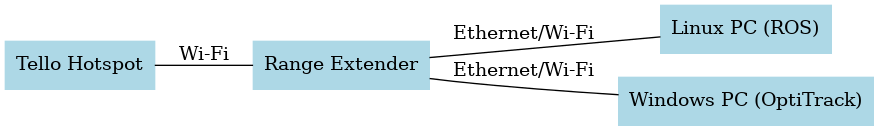

# ROS Navigation Scheme with OptiTrack

Welcome to the ROS Navigation Scheme repository! This repository contains a ROS package developed using `rospy` to enable a drone to navigate to any position within an OptiTrack motion capture system area. This guide provides instructions on how to set up, run, and understand the navigation scheme.

## Table of Contents

- [Introduction](#introduction)
- [Features](#features)
- [Prerequisites](#prerequisites)
- [Installation](#installation)
- [Usage](#usage)


## Introduction

This ROS package provides a navigation scheme that allows a drone to fly to specified positions within an OptiTrack motion capture system area. The system leverages ROS for communication and control, and the OptiTrack system for precise position tracking.

## Features

- **Position Control**: Navigate to any specified position within the OptiTrack area.
- **ROS Integration**: Utilizes ROS for communication and control.
- **OptiTrack Integration**: Leverages OptiTrack for accurate position tracking.

## Prerequisites

Before you begin, ensure you have the following installed:

- [ROS (Robot Operating System)](http://www.ros.org/)
- [OptiTrack Motion Capture System](https://optitrack.com/) (windows pc)
- Python 3.x
- `rospy`
- Additional ROS packages as required (e.g., `geometry_msgs`, `std_msgs`)

## Installation

1. **Install VRPN Client Ros**:
    ```bash
    sudo apt install ros-noetic-vrpn-client-ros

2. **Clone this repository**:
    clone this repository into the src folder of your catkin workspace
   ```bash
   cd ~/catkin_ws/src
   git clone https://github.com/yourusername/ros-optitrack-navigation.git
   cd ros-optitrack-navigation

3. **Build Package**:
    ```bash
    cd ~/catkin_ws
    catkin_make

4. **Network Setup**:
    The Tello DJI drone cannot have direct communications between the connected devices. To enable the streaming of OptiTrack data from one PC to another, a range extender is required. The network setup is illustrated in the following diagram:

    

    In this setup:
    The Hotspot provides the initial network connection.
    The Range Extender connects to the Hotspot and extends the network.
    PC 1 and PC 2 are connected to the Range Extender via Ethernet or Wi-Fi.
    This configuration ensures that OptiTrack data can be streamed from one PC to another, facilitating the control and navigation of the Tello DJI drone.

## Usage

1. **Run the Navigation Node**:
    ```bash
    roslaunch ros-optitrack tello_optitrack.launch & rosrun rviz rviz -f world

- add tf on rviz display window